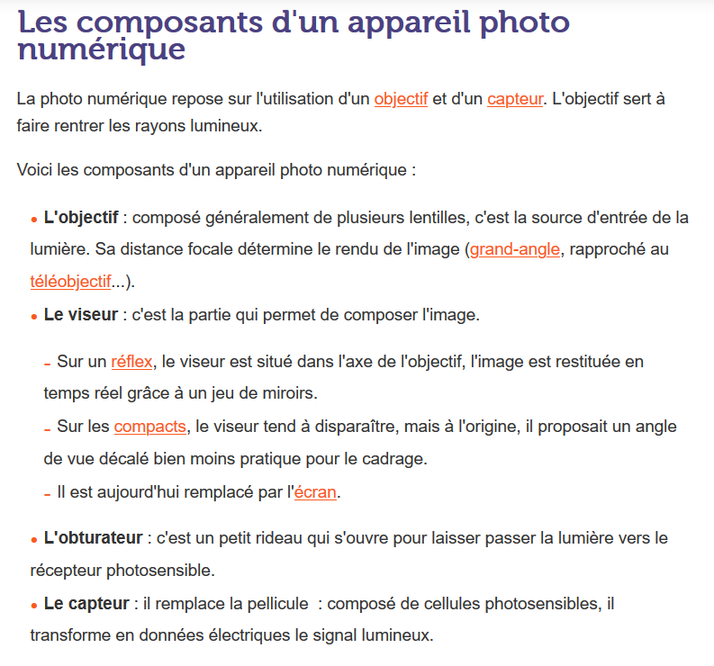
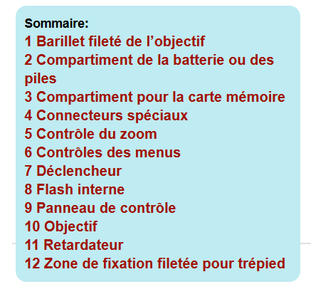
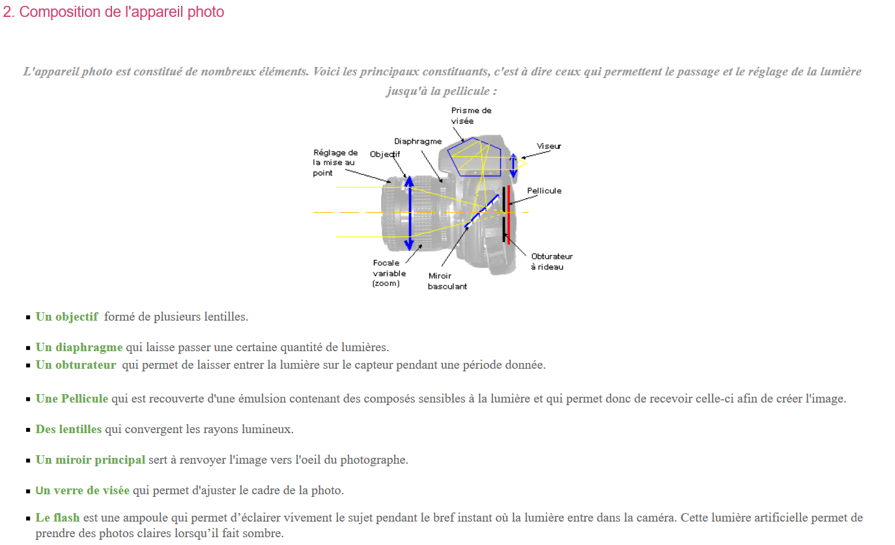
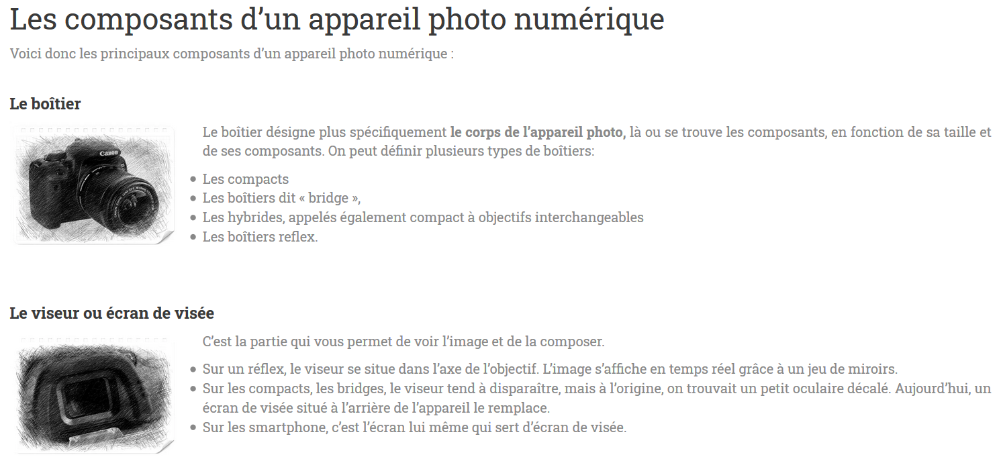

[Accueil](index.md)

## 3. Ses composants

| OOREKA. "Comment fonctionne un appareil photo numérique ?" [en ligne]. In *Ooreka maison*. [S.d.] [consulté le 26 mai 2020]. Disponible sur le Web : <https://appareil-photo-numerique.ooreka.fr/751803/rubrique/751805/comment-fonctionne-un-appareil-photo-numerique> |

| SAVOIR.FR. "Les composants fondamentaux d'un appareil photo" [en ligne]. In *Savoir.fr : hightech*. Mise à jour le 15 décembre 2011 [consulté le 26 mai 2020]. Disponible sur le Web : <https://hightech.savoir.fr/les-composants-fondamentaux-dun-appareil-photo-numerique/> |

| LEBAILLY, Pauline et LEMARDELE, Anaïs. "Composition de l'appareil photo" [en ligne]. In *TPE sur la photographie argentique*. [S.d.] [consulté le 26 mai 2020]. Disponible sur le Web : <https://sites.google.com/site/photographieargentiquetpe/composition-de-l-appareil-photo> |

| LAROCHE, Grégory. "L'anatomie d'un appareil photo" [en ligne]. In *Bon plan photo : Grégory Laroche*. [S.d.] [consulté le 26 mai 2020]. Disponible sur le Web : <http://www.gregorylaroche.fr/lanatomie-dun-appareil-photo/> |
