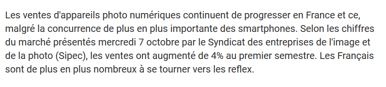
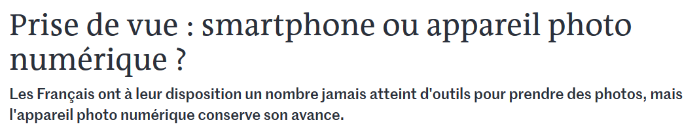
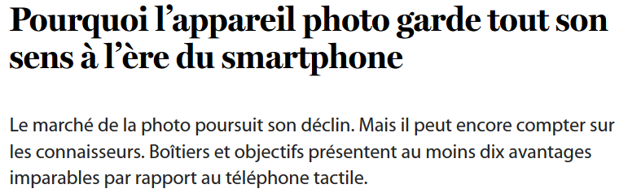
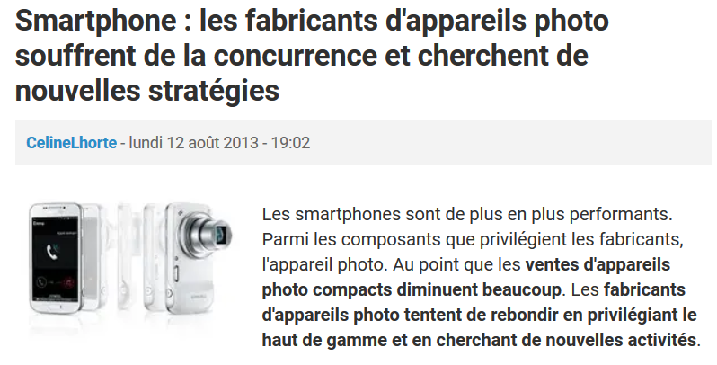

## 5. Le duel smartphone VS appareil photo numérique

| COMMENT CA MARCHE. "Les ventes d'appareils photo augmentent, malgré la concurrence des smartphones" [en ligne]. In *Comment ça marche*. Mise à jour le 7 octobre 2010 [consulté le 26 mai 2020]. Disponible sur le Web : <https://www.commentcamarche.net/news/5853170-les-ventes-d-appareils-photo-augmentent-malgre-la-concurrence-des-smartphones> |

| DAVAN-SOULAS, Melinda. "Les photos des smartphones sont de plus en plus belles : faut-il encore acheter un APN ?" [en ligne]. *LCI*. 2 avril 2019 [consulté le 26 mai 2020]. Disponible sur le Web : <https://www.lci.fr/high-tech/les-photos-des-smartphones-sont-de-plus-en-plus-belles-faut-il-encore-acheter-un-appareil-photo-numeriquer-reflex-mirrorless-compact-apn-canon-sony-lumix-ricoh-2116416.html> |

| LE MONDE AVEC AFP. "Prise de vue : smartphone ou appareil photo numérique ?" [en ligne]. *Le Monde*. Mise à jour le 25 mai 2020 [consulté le 26 mai 2020]. Disponible sur le Web : <https://www.lemonde.fr/vous/article/2012/10/24/prise-de-vue-smartphone-ou-appareil-photo-numerique_1780266_3238.html> |

| BOSSELER, Julien. "Pourquoi l’appareil photo garde tout son sens à l’ère du smartphone"[en ligne]. *Le Soir*. Mise à jour le 28 novembre 2018 [consulté le 26 mai 2020]. Disponible sur le Web : <https://plus.lesoir.be/192661/article/2018-11-28/pourquoi-lappareil-photo-garde-tout-son-sens-lere-du-smartphone?referer=%2Farchives%2Frecherche%3Fdatefilter%3Danytime%26sort%3Ddate%2520desc%26word%3Dsmartphone%2520appareil%2520photo%2520num%25C3%25A9rique> |

| CELINELHORTE. "Smartphone : les fabricants d'appareils photo souffrent de la concurrence et cherchent de nouvelles stratégies" [en ligne]. In *Comment ça marche*. Mis à jour le 12 août 2013 [consulté le 26 mai 2020]. Disponible sur le Web : <https://www.commentcamarche.net/news/5862940-smartphone-les-fabricants-d-appareils-photo-souffrent-de-la-concurrence-et-cherchent-de-nouvelles-strategies>

