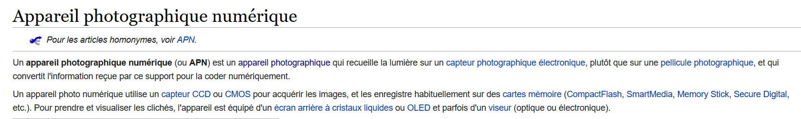
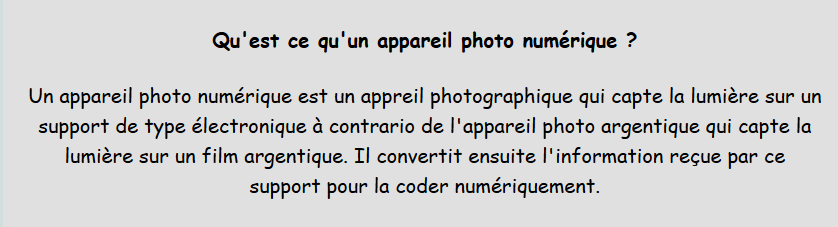

## L'appareil photo numérique 

### 1. Définition

### 2. Son histoire

### 3. Ses composants

### 4. Ses différents types
* Le compact

* Le reflex

* L'hybride

* Le bridge

### 5. Son succès

Si vous préférez les vidéos, [C'est pas sorcier !](https://www.youtube.com/watch?v=l9yCIbvD2S0) résume très bien les différents appareils photos numériques et comment ils fonctionnent.
