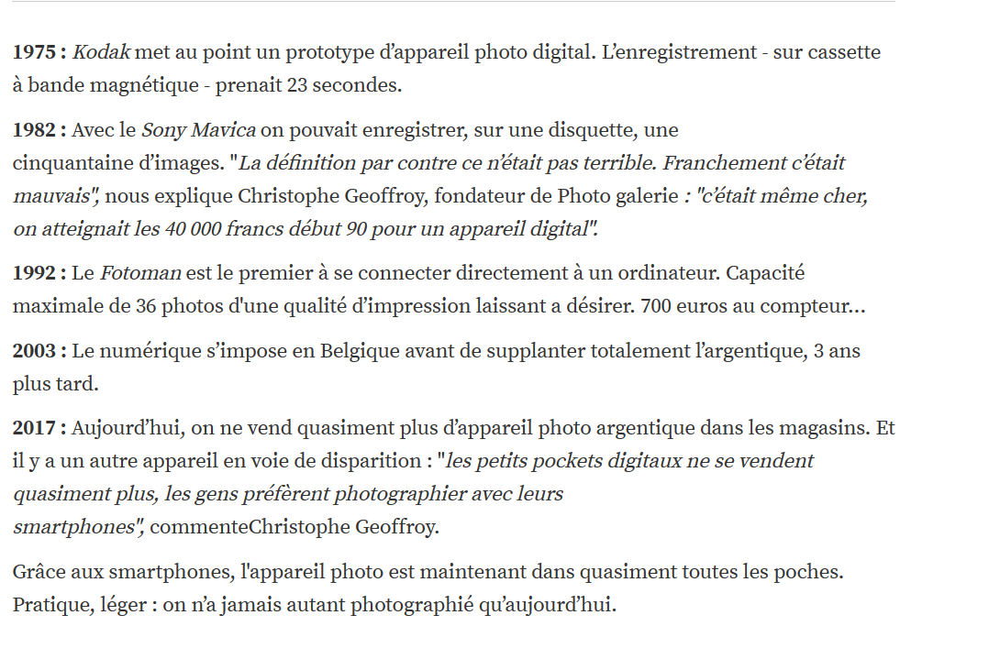
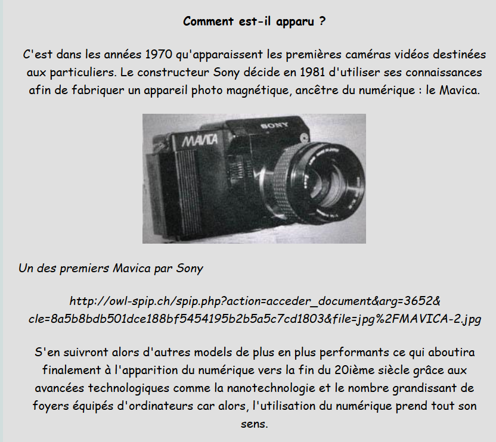

# [Accueil](index.md)

## 2. Son histoire

|  VIVACITE. "L'appareil photo numérique en 5 dates clés" [en ligne]. In *RTBF*. Mise à jour le 11 janvier 2018 [consulté le 18 mai 2020]. Disponible sur le Web : <https://www.rtbf.be/vivacite/emissions/detail_on-n-est-pas-des-pigeons/accueil/article_l-appareil-photo-numerique-en-5-dates-cles?id=9807595&programId=8792>  |

|  ANONYME. "L'appareil photo numérique" [en ligne]. In *L'évolution de la photographie : de l'argentique au numérique*. Mise à jour en 2011 [consulté le 3 mai 2020]. Disponible sur le Web : <http://histoiredelaphoto.e-monsite.com/pages/l-appareil-photo-numerique.html>  |

| LOUVET, Jean-Pierre. "La photo numérique : du capteur à l'image. Histoire de la photo numérique" [en ligne]. In *FuturaTech*. Mise à jour le 9 mai 2017 [consulté le 18 mai 2020]. Disponible sur le Web : <https://www.futura-sciences.com/tech/dossiers/technologie-photo-numerique-capteur-image-773/page/3/>  |

Pour lire la suite, vous pouvez cliquer sur l'image et aller à la page 8 du PDF.

|  Melvin. "Histoire de l'appareil photo" [en ligne]. In *ToutComment*. Mise à jour le 25 juin 2019 [consulté le 18 mai 2020]. Disponible sur le Web : <https://education.toutcomment.com/article/histoire-de-l-appareil-photo-14014.html>  |

