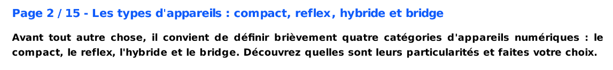
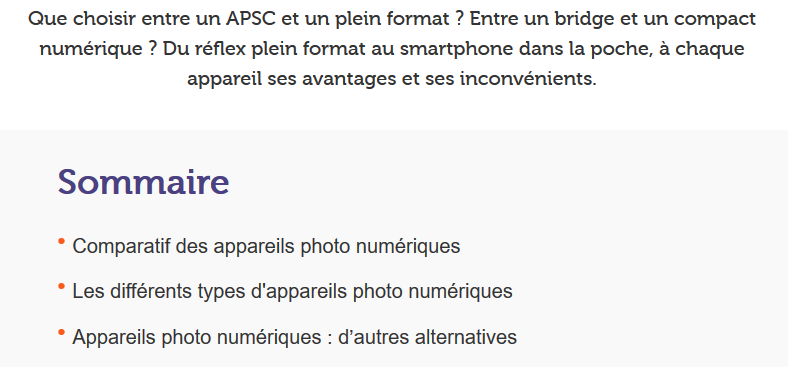
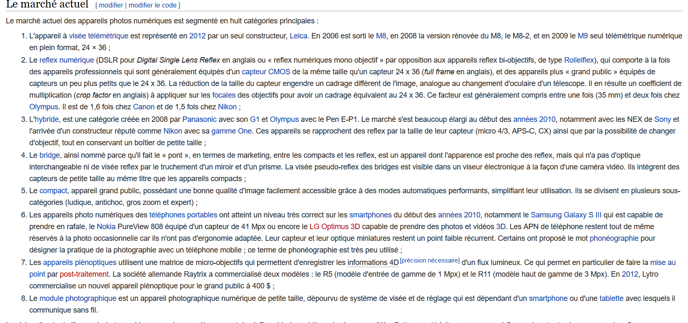

# [Accueil](index.md)

## 4. Ses différents types

| LOUVET, Jean-Pierre. "La photo numérique : du capteur à l'image. Les types d'appareils : compact, reflex, hybride et bridge" [en ligne]. In *FuturaTech*. Mise à jour le 9 mai 2017 [consulté le 18 mai 2020]. Disponible sur le Web : <https://www.futura-sciences.com/tech/dossiers/technologie-photo-numerique-capteur-image-773/page/2/>  |

| OOREKA. "Les différetns types d'appareils photo numériques" [en ligne]. In *Ooreka maison*. [S.d.] [consulté le 26 mai 2020]. Disponible sur le Web : <https://appareil-photo-numerique.ooreka.fr/751803/rubrique/751807/les-differents-types-d-appareils-photo-numeriques> |

| WIKIPEDIA. "Appareil photo numérique" [en ligne]. In *Wikipédia. L'encyclopédie libre*. Mise à jour le 27 novembre 2019 [consulté le 3 mai 2020]. Disponible sur le Web : <https://fr.wikipedia.org/wiki/Appareil_photographique_num%C3%A9rique> |

